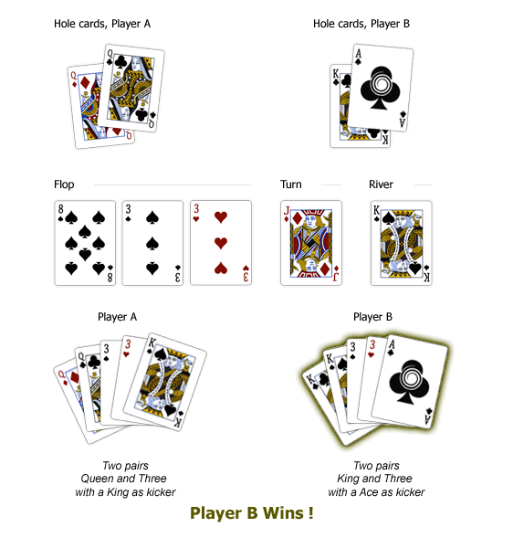
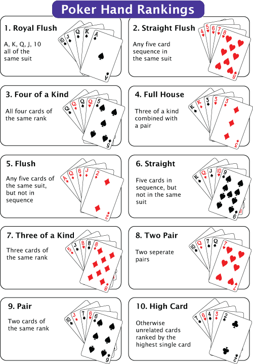

# Kata Texas Hold'em

This kata is based in [kata texas coding dojo](http://codingdojo.org/kata/TexasHoldEm/)

## The problem

### Problem description

You work for a cable network; specifically, you are the resident hacker for a Texas Hold’Em Championship show.

The show’s producer has come to you for a favor. It seems the play-by-play announcers just can’t think very fast. 
All beauty, no brains. The announcers could certainly flap their jaws well enough, if they just knew what hands the players were holding and which hand won the round. 
Since this is live TV, they need those answers quick. Time to step up to the plate. Bob, the producer, explains what you need to do.

**BOB**: Each player’s cards for the round will be on a separate line of the input. 
Each card is a pair of characters, the first character represents the face, the second is the suit. 
Cards are separated by exactly one space. Here’s a sample hand.

```bash
  Kc 9s Ks Kd 9d 3c 6d
  9c Ah Ks Kd 9d 3c 6d
  Ac Qc Ks Kd 9d 3c
  9h 5s
  4d 2d Ks Kd 9d 3c 6d
  7s Ts Ks Kd 9d
```

**YOU**: Okay, I was going ask what character to use for 10, but I guess ’T’ is it. 
And ‘c’, ’d’, ‘h’ and ’s’ for the suits, makes sense. Why aren’t seven cards listed for every player?

**BOB**: Well, if a player folds, only his hole cards and the community cards he’s seen so far are shown.

**YOU**: Right. And why did the fifth player play with a 4 and 2? They’re suited, but geez, talk about risk…

**BOB**: Stay on topic. Now, the end result of your code should generate output that looks like this:

```bash
  Kc 9s Ks Kd 9d 3c 6d Full House (winner)
  9c Ah Ks Kd 9d 3c 6d Two Pair
  Ac Qc Ks Kd 9d 3c 
  9h 5s 
  4d 2d Ks Kd 9d 3c 6d Flush
  7s Ts Ks Kd 9d
``` 
**YOU**: Okay, so I repeat the cards, list the rank or nothing if the player folded, and the word “winner” in parenthesis next to the winning hand. Do you want the cards rearranged at all?

**BOB**: Hmmm… we can get by without it, but if you have the time, do it. Don’t bother for folded hands, but for ranked hands, move the cards used to the front of the line, sorted by face. Kickers follow that, and the two unused cards go at the end, just before the rank is listed.

**YOU**: Sounds good. One other thing, I need to brush up on the hand ranks. You have any good references for Texas Hold’Em?

**BOB**: Yeah, do an internet search on Poker Hand Rankings. And if you need it, the Rules of Texas Hold’Em. While ranking, don’t forget the kicker, the next highest card in their hand if player’s are tied. And of course, if – even after the kicker – player’s are still tied, put “(winner)” on each appropriate line of output.

**YOU**: Ok. I still don’t understand one thing…

**BOB**: What’s that?

**YOU**: Why he stayed in with only the 4 and 2 of diamonds? That’s just…

**BOB**: Hey! Show’s on in ten minutes! Get to work!


## The solution

The solution has been coded using **TDD Outside-In** in order to help to create the design.

The goal of the kata was not just generate the expected output, but generate an **immutable domain** with the logic as **pure functions**, decoupling it from the input/output parsing. 

### Environment
```scala
sbt.version = 1.1.2
scalaVersion := "2.12.5"
```

### Build and run the tests
```bash
sbt test 
```

### Approach

There is one single entry point for the designed solution, and it orchestrate the different parts of the problem, 
it is called **showdown**, is a situation when, if more than one player remains after the last betting round, 
remaining players expose and compare their hands to determine the winner or winners:

Entry point: [Showdown.scala](src/main/scala/com/albertortizl/katas/poker/Showdown.scala)

Orchestrate:

1. Parse List of strings to the domain
2. Compare hands of the players:
     - Calculate the best hand of each player
     - Determine who is the winner/s 
3. Parse domain to the expected output


```scala
val hands = List(
        "Kc 9s Ks Kd 9d 3c 6d",
        "9c Ah Ks Kd 9d 3c 6d",
        "Ac Qc Ks Kd 9d 3c"
      )    
val result = new Showdown() evaluate hands
```

The design was made using as an starter point, **user stories** and tdd outside-in, take a look in user stories in:

- [ShowdownSpec](src/test/scala/com/albertortizl/katas/poker/ShowdownSpec.scala)


#### Domain

Texas hold'em is a variation of the card game of poker. 

It is played with an English pack of 52 cards (jokers are not used). 

So here comes the first domain, the deck as [adt](https://alvinalexander.com/scala/fp-book/algebraic-data-types-adts-in-scala):
```scala
sealed abstract class Suite
case object Hearts extends Suite   //♥
case object Diamonds extends Suite //♦
case object Spades extends Suite   //♠
case object Clubs extends Suite    //♣

sealed abstract class Rank(val value:Int) {
  def of(suite:Suite) :Card = Card(this, suite)
}
case object Two extends Rank(2)
case object Three extends Rank(3)
case object Four extends Rank(4)
case object Five extends Rank(5)
case object Six extends Rank(6)
case object Seven extends Rank(7)
case object Eight extends Rank(8)
case object Nine extends Rank(9)
case object Ten extends Rank(10)
case object Jack extends Rank(11)
case object Queen extends Rank(12)
case object King extends Rank(13)
case object Ace extends Rank(14)
```

Tables join between 6 and 10 players.

In Texas Hold'em players receive two cards. Another five community cards are put face up on the table; these cards are used by all players to get their best 5 card combination.

<p align="center">
  
</p>

So we could abstract this in two different models:

1. The player: (hole cards + community cards)
```scala
case class HoleCards(first: Card, second: Card)
case class Player(holeCards: HoleCards, communityCards: List[Card]) {
  def fold: Boolean = communityCards.lengthCompare(5) < 0
  def allCards: List[Card] = holeCards.first :: holeCards.second :: communityCards
}
```
2. The different states of the hand of the player

   - Fold: The player folded
   - Finalist: The player is in the last round showing its cards and pending to be compared with their opponents
   - Winner: The hand which wins the final pot
 
```scala

sealed trait HandState
case class Folded(player: Player) extends HandState
case class Finalist(player: Player, bestHand: Hand) extends HandState
case class Winner(player: Player, bestHand: Hand) extends HandState
```

Finally, the hand and the possible combinations (the hand ranking):
```scala
case class Hand(cards: List[Card], ranking: HandRanking)
```

<p align="center">
  
</p>

```scala
sealed abstract class HandRanking(val value: Int, val name:String)
case object RoyalFlush extends HandRanking(10, "Royal Flush")
case object StraightFlush extends HandRanking(9, "Straight Flush")
case object FourOfAKind extends HandRanking(8, "Four of a Kind")
case object FullHouse extends HandRanking(7, "Full House")
case object Flush extends HandRanking(6, "Flush")
case object Straight extends HandRanking(5, "Straight")
case object ThreeOfAKind extends HandRanking(4, "Three of a Kind")
case object TwoPair extends HandRanking(3, "Two Pair")
case object OnePair extends HandRanking(2, "One Pair")
case object HighCard extends HandRanking(1, "High Card")
```

#### Calculating the ranking

As a part of this problem, it was to create a code to calculate the ranking of a hand, but trying to generate a code that
someone without coding skills was able to verify that they are implemented correctly.

```scala
      if (cards.haveSameSuit && cards.areConsecutive && cards.haveHighCard(Ace)) RoyalFlush
      else if (cards.haveSameSuit && cards.areConsecutive) StraightFlush
      else if (cards.haveGroupOf(4)) FourOfAKind
      else if (cards.haveGroupsOf(3)(2)) FullHouse
      else if (cards.haveSameSuit) Flush
      else if (cards.areConsecutive) Straight
      else if (cards.haveGroupOf(3)) ThreeOfAKind
      else if (cards.haveGroupsOf(2)(2)) TwoPair
      else if (cards.haveGroupOf(2)) OnePair
      else HighCard
```
Check the rest of the ranking code in [ranking](src/main/scala/com/albertortizl/katas/poker/ranking.scala)  
  
#### Determining the winner

To determine the winner is just compare hands, so it seems pretty simple, but the difficult is when there is a tie:

- [tie-breaker-rules](https://www.adda52.com/poker/poker-rules/cash-game-rules/tie-breaker-rules)

- Check the compare hands algorithm in [HandComparator](src/main/scala/com/albertortizl/katas/poker/hands.scala#L49)

- Check the different test scenarios in [HandComparatorTest](src/test/scala/com/albertortizl/katas/poker/HandComparatorTest.scala)   


#### Some extensions

The input/output could be override, they are just functions by default that can be override as you want providing them 
as a DI in Showdown class constructor parameters:

- Input : (String) -> Player
- Output: (HandState) -> String   

### Out of scope / to improve

- General semantic validation:
  - Check card repetitions
  - Check invalid showdowns (all fold hands, invalid number of players...) 
- Rearranging the cards extension
